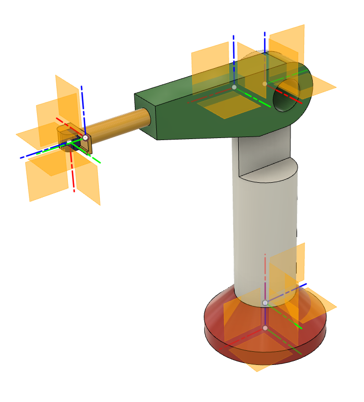
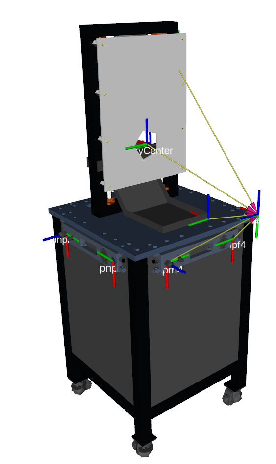
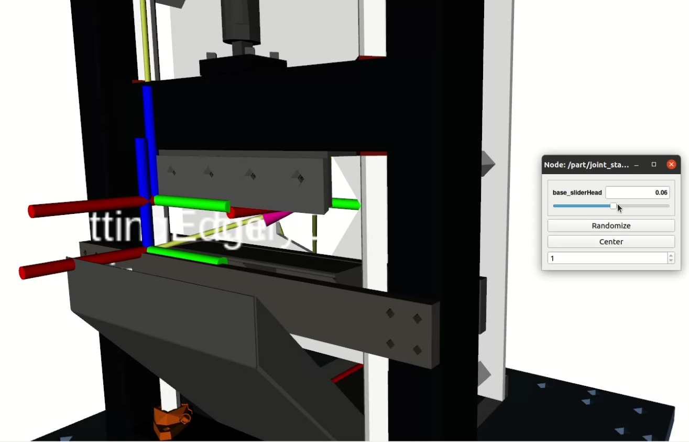

      
     
# urdf_from_step


## About

This is ROS package for automated conversion of STEP models to URDF format. The program takes as input the STEP file (left images) of the desired robot or robot-like maschine and creates a new ROS package. The package created contains the URDF description, the STL mesh files required by URDF description, and the ROS launch file to load the data into the ROS for visualization (center images) and control (right images). 

Simple robot arm:

      


Cutter module from Reconcycle project:

      


### Working principle

The URDF file is generated in the following steps. First, the STEP file is loaded and its contents are analyzed using tools from the Open Cascade Technology (OCCT) library [1]. The analysis looks for keywords such as "joint" and "link" in the part names or in the assembly names in the model design tree. The instances with these keywords in their names represent the corresponding "joint" and "link" building blocks of URDF. The remaining part names containing the keyword encode the connections between individual URDF elements and their names in the URDF file. Once these instances and their connections have been identified, the correct local transformation between them must be computed from the values of their base coordinate systems in the STEP file. The calculated local transformations are transformed accordingly into the coordinate system values of the "joint" and "link" URDF definitions. The instances that do not have keywords in their names represent geometric shapes. They are transformed into the STL mesh specified in the appropriate local coordinate system according to the given URDF tree structure. From the collected and computed URDF data, the XML in URDF format is created using the urdfdom parser library. Finally, everything is stored in a newly created ROS package.


## Instalation

Because of the challenging installation of the required python package [pythonOCC-core](https://github.com/tpaviot/pythonocc-core) is highly recommended to use a docker image.

### Docker

Docker repository source is [hier](https://github.com/ReconCycle/urdf-from-step-docker).

Builded docker image is [hier](https://github.com/ReconCycle/urdf-from-step-docker/pkgs/container/urdf-from-step).

Pulling builded docker image:

```bash
docker pull ghcr.io/reconcycle/urdf-from-step:latest
```


## Usage


The examples and manuals are provided [hier](https://github.com/ReconCycle/urdf-from-step-examples).

Preparation of STEP file is on the example of a simple robot arm described [hier](https://github.com/ReconCycle/urdf-from-step-examples/tree/main/documentation/step_file_creation).

The prepared step file is turned to the corresponding ROS package containing URDF like this:

```bash
roslaunch urdf_from_step build_urdf_from_step.launch step_file_path:="/input_step_files/robot_arm.step" urdf_package_name:="robot_arm"

```
The created package needs to be added to the catkin workspace for building, sourcing, and launching:

```bash
catkin build robot_arm
cd catkin_ws
source devel/setup.bash
roslaunch robot_arm load_urdf.launch
```


More detailed manuals regarding use conversion from STEP to URDF are provided in [hier](https://github.com/ReconCycle/urdf-from-step-examples/tree/main/documentation/step_to_urdf_conversion).

Where also the instruction for URDF visualization are provided [hier](https://github.com/ReconCycle/urdf-from-step-examples/tree/main/documentation/visualization).

## References

* [1] pythonocc: Thomas Paviot. (2022). pythonocc (7.7.0). Zenodo. https://doi.org/10.5281/zenodo.3605364


## Funding

  

This project has received funding from the European Union’s Horizon 2020 research and innovation programme under grant agreement No. 871352. 
